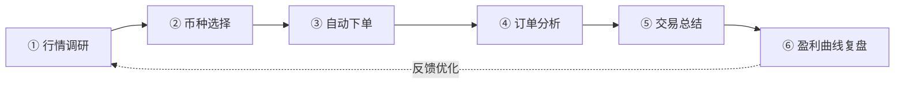

# 个人交易助手 · 产品需求文档（PRD）

> **版本**：v0.1（MVP）

---

## 1. 产品概述

### 1.1 一句话定位

面向**个人加密交易者**的「交易闭环」AI 助手：从行情调研、币种选择、自动下单，到订单分析、交易总结、盈利曲线复盘，覆盖**一笔交易的完整生命周期**。

### 1.2 核心问题

| 痛点 | 表现 | 本产品对应解法 |
|---|---|---|
| 信息分散 | 行情、消息、板块、Alpha 项目散落在多个渠道，缺乏统一聚合 | 行情调研模块（板块轮动 + 宏观消息面 + Alpha 监控） |
| 决策随意 | 开仓缺逻辑、平仓不复盘、同类错误反复犯 | 币种选择策略 + 平仓订单复盘 |
| 情绪驱动 | 连续盈/亏后容易上头或恐慌，缺一个"冷静的第三方" | 资金曲线分析 + 定期风险提示 |

### 1.3 产品主张

用 AI 把「**调研 → 决策 → 执行 → 复盘**」串成一个**可循环、可沉淀**的闭环——让每一笔交易都做到：有据可依、有迹可查、有反馈可改进。

### 1.4 目标用户

- 加密市场的活跃个人交易者（现货 / 合约）
- 有一定交易经验、希望从「凭感觉」走向「系统化、纪律化」的散户
- **单用户视角**（个人账户绑定，toC，不涉及机构 / 团队协作）

---

## 2. 产品主线：交易闭环

**闭环阶段 → 功能模块映射**

| 闭环阶段 | 对应模块 | 您原始构想中的来源 |
|---|---|---|
| ① 行情调研 | M1 行情调研 | 思路 1（板块轮动）、思路 2（宏观消息面） |
| ② 币种选择 | M2 币种选择（核心策略） | 思路 3（Binance Alpha 定投策略） |
| ③ 自动下单 | M3 自动下单 | 闭环描述「到自动下单」 |
| ④ 订单分析 / ⑤ 交易总结 | M4 订单分析与交易总结 | 思路 4（平仓订单复盘 + 诊断） |
| ⑥ 盈利曲线复盘 | M5 盈利曲线复盘 | 思路 5（资金曲线分析 + 风险提示） |

---

## 3. 功能模块详述

### M1 · 行情调研

> **目标**：把分散的行情情报聚合成一个"每日可看的研判面板"，回答用户两个问题：现在哪里热？有什么会影响市场的大事？

#### M1.1 板块轮动

- **核心功能**：通过 AI 分析当前市场，展示**正在火热的板块**，并在每个板块下展示其**龙头币种**。
- **关键逻辑**：
  - 板块热度判定（如资金流入、涨幅、热度趋势等综合信号，AI 归纳排序）
  - 板块内龙头识别（板块内代表性、流动性、相对强度）
- **输出**：热门板块榜单 → 每个板块的龙头币种列表
- **交付要点**：用户打开即可看到「当前 Top N 热门板块 + 各板块龙头」，无需手动配置。

#### M1.2 宏观消息面

- **核心功能**：利用 AI 追踪**突发事件 / 热点新闻**，聚焦那些**能影响全球金融市场、尤其是加密市场**的消息（如地缘冲突、央行降息等）。
- **关键逻辑**：
  - 事件抓取与去噪（过滤无关噪声，保留高影响力事件）
  - AI 摘要 + 影响研判（这条消息「为什么重要」「可能影响哪个方向」）
- **输出**：宏观要闻流（事件标题 + AI 一句话影响解读）
- **交付要点**：消息**带 AI 解读**，而非单纯的新闻聚合；保证时效性。

---

### M2 · 币种选择（核心策略）

> **目标**：本产品的**差异化内核**。把"看行情"落地为"选哪个币、怎么进场"的可执行信号。

#### M2.1 Binance Alpha 定投策略

- **策略思想（独有策略）**：
  - Binance Alpha 项目**存在明确的拉盘预期**——拉盘本质是一个**流动性退出**的过程；
  - 因此，那些**长期在底部盘整**的 Alpha 项目，具备**定投价值**，可博取拉盘带来的收益。
- **核心功能**：
  1. **定时采集** Binance Alpha 项目信息（项目列表、行情数据），周期性更新；
  2. **策略筛选**：识别「底部长期盘整」的项目（如：盘整时长、波动收敛、距前高回撤幅度等量化特征，由策略规则 + AI 辅助判定）；
  3. **生成候选**：输出**值得定投的标的清单**及对应信号。
- **输出**：Alpha 定投候选标的列表（项目 + 盘整特征 + 定投建议）
- **交付要点**：
  - 采集需稳定、定时；
  - 筛选标准可解释（用户能看到「为什么这个项目入选」）。

> ⚠️ **产品提示（非新增功能）**：该策略基于「Alpha 必然拉盘」的假设，属于**策略假设**。建议在 UI 中始终伴随风险提示，并在后续迭代中支持"信号准确率/历史表现"的可视化，让用户用数据自行校验。MVP 阶段仅需呈现信号 + 风险提示即可。

---

### M3 · 自动下单

> **目标**：把"币种选择"产生的决策转化为真实交易执行，闭合"决策 → 执行"这一环。
> **⚠️ 风险定级：本模块为全闭环中风险与复杂度最高的一环（涉及真实资金、交易权限）。**

- **核心功能**：根据用户确认的策略 / 信号，向交易所下单。
- **关键逻辑**：
  - 绑定交易所交易权限（API Key）
  - 下单参数管理（标的、方向、金额 / 仓位、定投频率等）
  - 执行结果回执与记录（成交 / 失败状态回写，供后续复盘）
- **输出**：已执行订单记录（自动进入 M4 复盘数据源）
- **交付要点**：下单可追溯、失败有反馈、关键操作有二次确认。

> 💡 **MVP 取舍建议（降复杂度，见第 4 节）**：MVP 可先做**半自动**——产品给出信号 + 一键确认下单，由用户最终点击执行；**全自动托管**放入后续迭代。这样既保留闭环，又显著降低资金风险与工程复杂度。

---

### M4 · 订单分析与交易总结

> **目标**：把"已经发生的交易"变成"可学习的经验"。这是闭环里把"经验沉淀下来"的关键环节。

#### M4.1 平仓订单复盘与诊断

- **核心功能**：
  1. 从交易所**拉取已平仓订单**信息；
  2. 对每笔/每段交易做**自动复盘总结**；
  3. 支持用户**输入自己的开仓 / 平仓逻辑**，AI 结合用户的开仓评价逻辑，做**复盘 + 诊断**。
- **关键逻辑**：
  - 平仓订单数据拉取与结构化（盈亏、持仓时间、入场/出场点位等）
  - AI 复盘：对照用户填写的开/平仓逻辑，评价"这笔交易做得对不对、问题出在哪"
- **输入**：已平仓订单数据 + 用户填写的开仓/平仓逻辑（可选）
- **输出**：单笔/阶段交易复盘报告（盈亏归因 + AI 诊断建议）
- **交付要点**：
  - 用户**不填逻辑**也能得到基础复盘；**填了逻辑**则得到更精准的"对照式诊断"；
  - 诊断要给出可执行的改进点，而非空泛点评。

---

### M5 · 盈利曲线复盘

> **目标**：从单笔视角上升到**账户整体视角**，并在情绪化的关键节点主动介入，充当"冷静的第三方"。

#### M5.1 资金曲线分析与风险提示

- **核心功能**：
  1. 对个人**资金曲线（盈利曲线）**进行分析；
  2. **定期做风险提示**；
  3. 在**连续亏损或连续盈利**时，由 AI 主动介入，做一次**冷静的近期复盘**（避免上头 / 恐慌）。
- **关键逻辑**：
  - 资金曲线计算（回撤、连续盈亏次数、波动等关键指标）
  - 触发机制：连续亏损 / 连续盈利 → 触发 AI 介入复盘
  - 风险提示：定期 + 事件触发两种方式
- **输出**：资金曲线视图 + 风险提示 + AI 阶段性复盘（在触发节点）
- **交付要点**：
  - 触发条件清晰（如"连续 N 次亏损"）；
  - AI 复盘语气**克制、冷静**，定位为提醒而非交易建议。

---

## 4. MVP 范围界定

> 原则：满足**核心闭环**的前提下平衡复杂度。下表区分 **P0（MVP 必做）/ P1（首版可降级或延后）**。

| 模块 | 子功能 | 优先级 | MVP 取舍说明 |
|---|---|---|---|
| M1 行情调研 | 板块轮动 | **P0** | 闭环起点，AI 聚合即可 |
| M1 行情调研 | 宏观消息面 | **P0** | 带 AI 解读的要闻流 |
| M2 币种选择 | Alpha 定投策略 | **P0 ★核心** | 产品差异化内核，必做 |
| M3 自动下单 | 下单执行 | **P1（建议半自动）** | MVP 先做「信号 + 一键确认下单」，全自动托管延后 |
| M4 订单分析 | 平仓复盘（自动） | **P0** | 闭环沉淀价值的核心 |
| M4 订单分析 | 用户逻辑对照诊断 | **P0** | 这是复盘的差异点，建议保留 |
| M5 盈利曲线 | 资金曲线分析 | **P0** | 账户级视角 |
| M5 盈利曲线 | 连续盈亏触发 AI 复盘 | **P0** | 情绪管理是产品独特价值，规则简单可做 |

**MVP 一句话范围**：
> 一个能**聚合行情情报 → 给出 Alpha 定投信号 → 一键确认下单 → 自动复盘平仓订单（可结合用户逻辑诊断）→ 分析资金曲线并在连续盈亏时主动提醒**的个人交易闭环工具。

**首版明确不做（避免复杂度膨胀）**：
- 全自动无人值守托管交易
- 多交易所 / 多账户聚合
- 社交、跟单、社区等协作功能
- 策略回测引擎（仅做信号呈现，不做历史回测）

---

## 5. 数据与外部依赖（产品层，不含技术实现）

| 依赖 | 用途 | 权限要求 |
|---|---|---|
| 交易所账户接口 | 拉取已平仓订单、资金/持仓数据 | **只读**（M4、M5） |
| 交易所交易接口 | 自动 / 半自动下单 | **交易权限**（M3，高敏感） |
| AI / 大模型能力 | 板块研判、消息解读、复盘诊断 | — |
| 行情 / 资讯数据源 | 板块、龙头、宏观消息 | — |
| Binance Alpha 数据 | Alpha 项目定时采集 | — |

---

## 6. 风险与合规

| 类别 | 说明 | 产品要求 |
|---|---|---|
| **资金安全** | 自动下单涉及真实资金与交易权限 | 关键操作二次确认；MVP 优先半自动；API Key 安全存储 |
| **投资风险** | 所有信号 / 复盘均非投资建议 | 全产品显著位置展示风险免责声明 |
| **策略假设风险** | Alpha 定投基于"必然拉盘"假设，存在失效可能 | 信号旁始终标注风险；后续支持表现可视化供用户自行校验 |
| **AI 输出可靠性** | AI 复盘 / 解读可能出错 | 定位为"辅助参考"，关键决策权保留在用户 |

---

## 7. 后续迭代（非 MVP）

- M3 全自动托管交易（含止盈止损、定投自动执行）
- Alpha 策略历史表现 / 信号准确率可视化
- 多交易所、多账户支持
- 复盘知识库：把历史诊断沉淀为个人"交易错题本"
- 策略回测能力

---

*本文档为 MVP 阶段产品定义，聚焦核心闭环。技术栈、接口设计、UI 细节将在后续阶段单独输出。*
